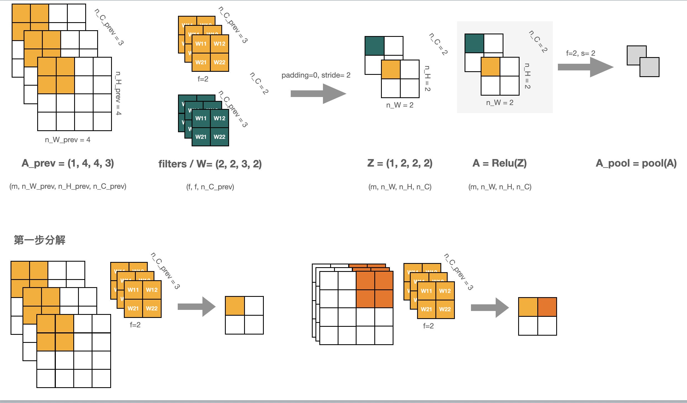
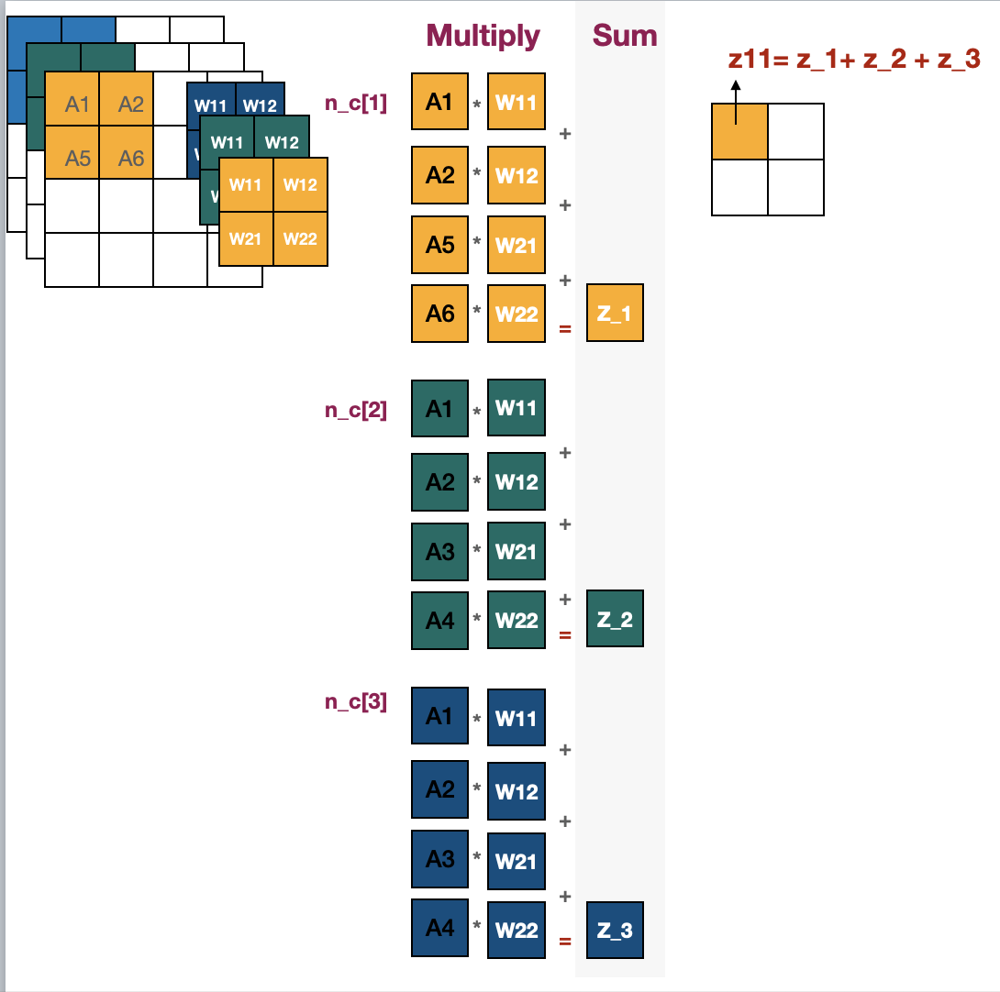
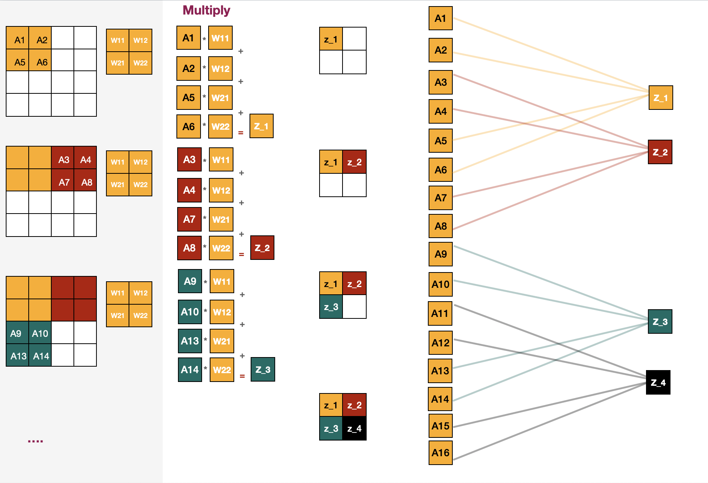
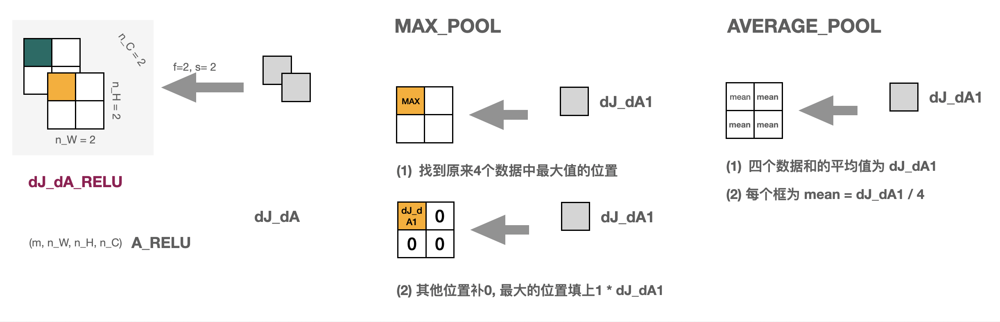
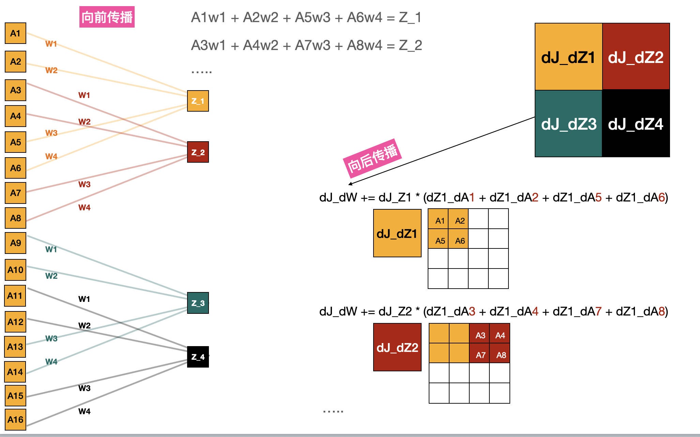

# 1. CNN - Forward Pass

**Conv -> Relu -> Max/Average Pool -> A**

## 1.1 Concept
- A_prev
- W(filters), b(bias)
- => Z
- => A_relu
- => A_pool

## 1.2 Steps

# 2. CNN - Backward Pass

## 2.1 Backward - Max Pool, Average Pool

## 2.2 Backward - Conv
